# Document Archiving System

## Project Description

The **Document Archiving System** is a secure and efficient solution for managing digital documents. This project leverages modern technologies like **Spring Boot**, **PostgreSQL**, **Kafka**, **Angular**, and **Docker** to provide robust functionalities for document storage, metadata management, and seamless communication between microservices.

## Features

- **Secure Document Management**: Add, edit, and download documents with robust access control.
- **Metadata Management**: Organize documents with descriptive metadata for easy searching and categorization.
- **Real-Time Communication**: Asynchronous microservice communication using **Apache Kafka**.
- **Intuitive UI**: A responsive and user-friendly interface built with **Angular**.
- **Logging and Monitoring**: Integrated with **ELK Stack** for application monitoring and data visualization.
- **Scalability**: Designed using a microservice architecture for horizontal scaling.

## Technologies Used

### Backend:
- **Spring Boot**: Framework for developing microservices.
- **PostgreSQL**: Relational database for storing documents and metadata.
- **Kafka**: Distributed messaging platform for microservice communication.
- **Hibernate**: ORM framework for database interaction.

### Frontend:
- **Angular**: Framework for building a dynamic and interactive UI.

### DevOps:
- **Docker**: Containerization for consistent deployment.
- **ELK Stack**: Monitoring and visualization tools for logs and performance data.

### Other Tools:
- **Lombok**: Reduces boilerplate code in Java classes.
- **Maven**: Build and dependency management tool.

## Application Architecture

The system is built with a microservice architecture, ensuring modularity and scalability. Key components include:

- **Frontend**: Built with Angular for document interaction and management.
- **Backend**: Consists of Spring Boot microservices for authentication, document processing, and communication.
- **Kafka**: Facilitates asynchronous communication between microservices.
- **ELK Stack**: Logs are processed and visualized for monitoring and debugging.
- **PostgreSQL**: Central database for all metadata and document records.

## Setup and Installation

1. Clone the repository:
   ```bash
   git clone https://github.com/your-repository/document-archiving-system.git
   ```

2. Navigate to the project directory:
   ```bash
   cd document-archiving-system
   ```
4. Access the application:
   - Frontend: [http://localhost:4200](http://localhost:4200)
   - Backend API: [http://localhost:8080/api](http://localhost:8080/api)

## Screenshots

### 1. Project Architecture
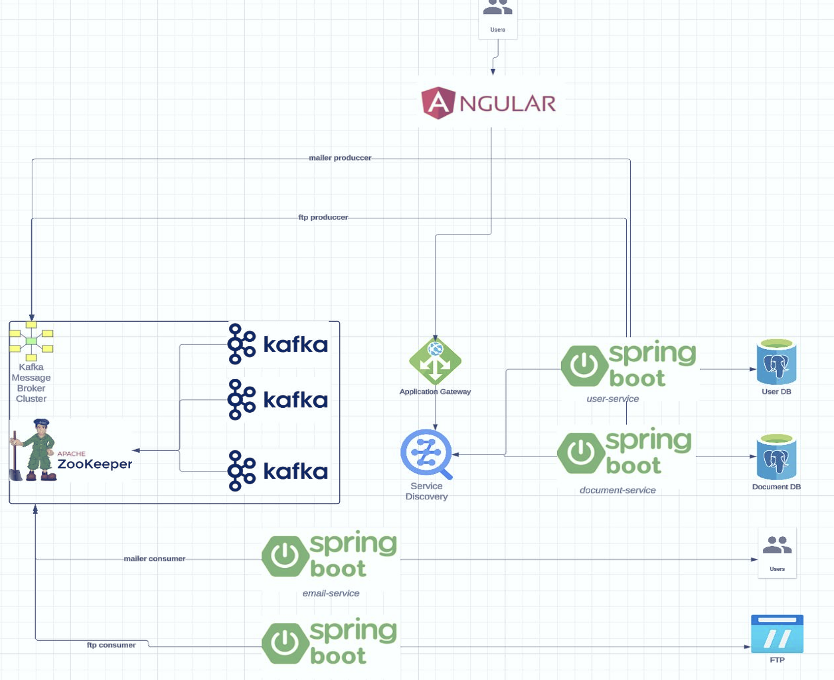

### 2. Login Page
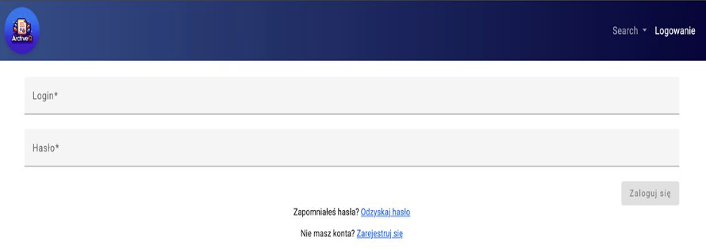

### 3. Metadata View
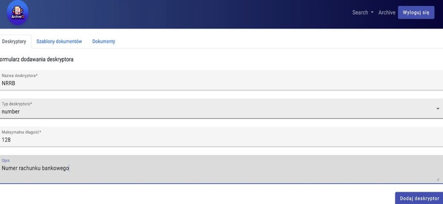
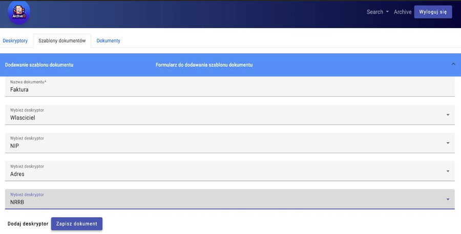

### 4. Create Document
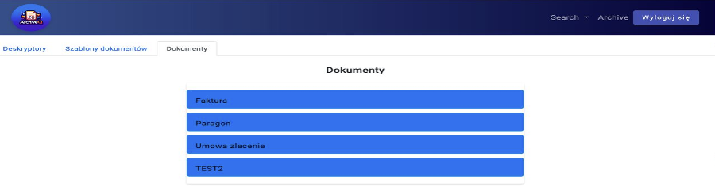
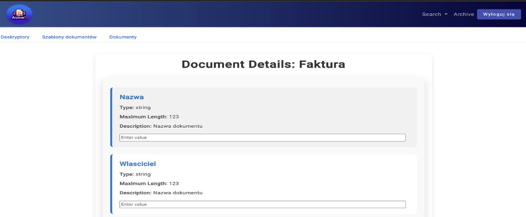
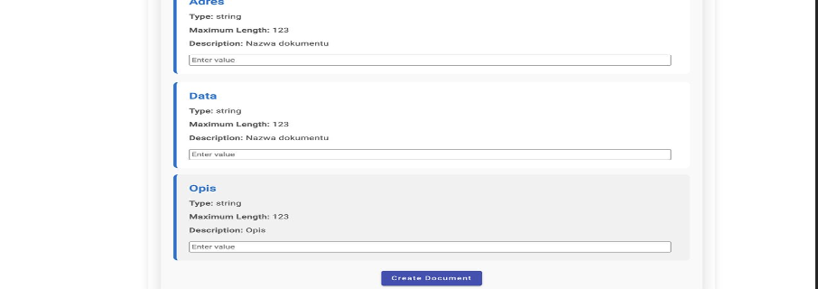

### 5. Search Document
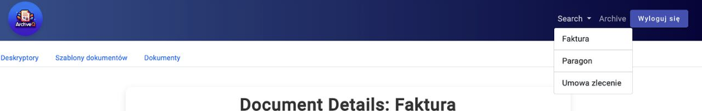
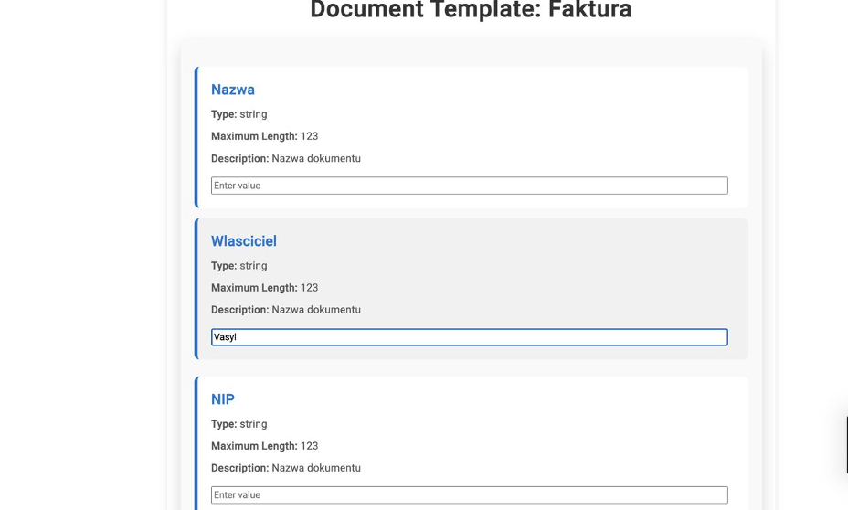
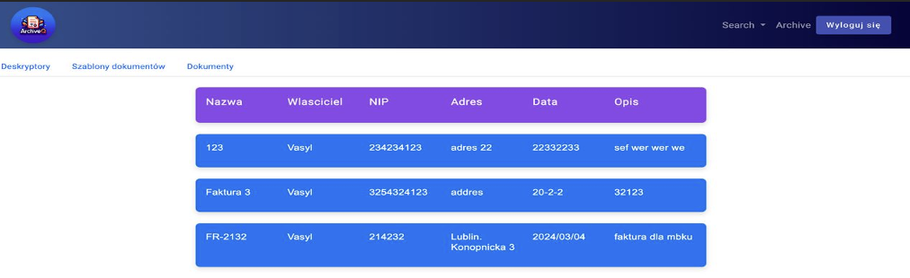

### 6. Update Document
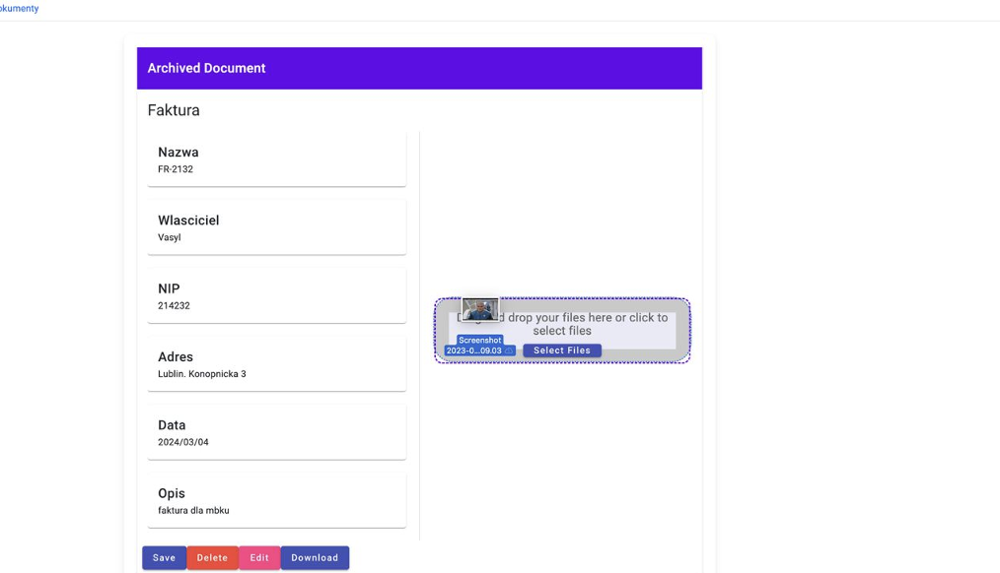
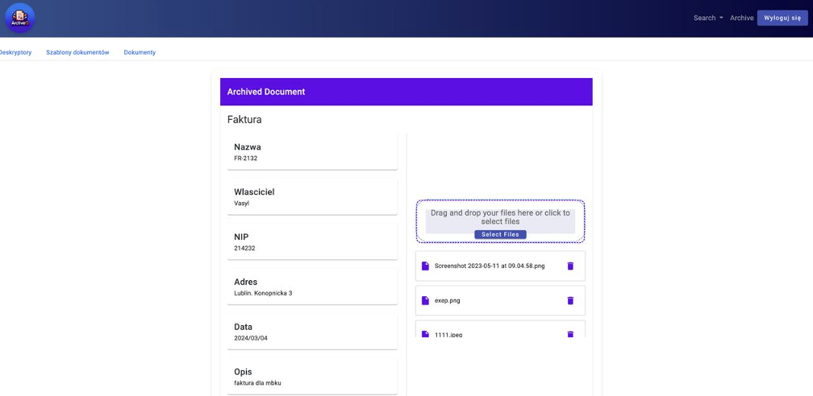
